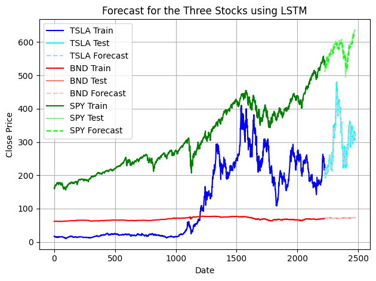
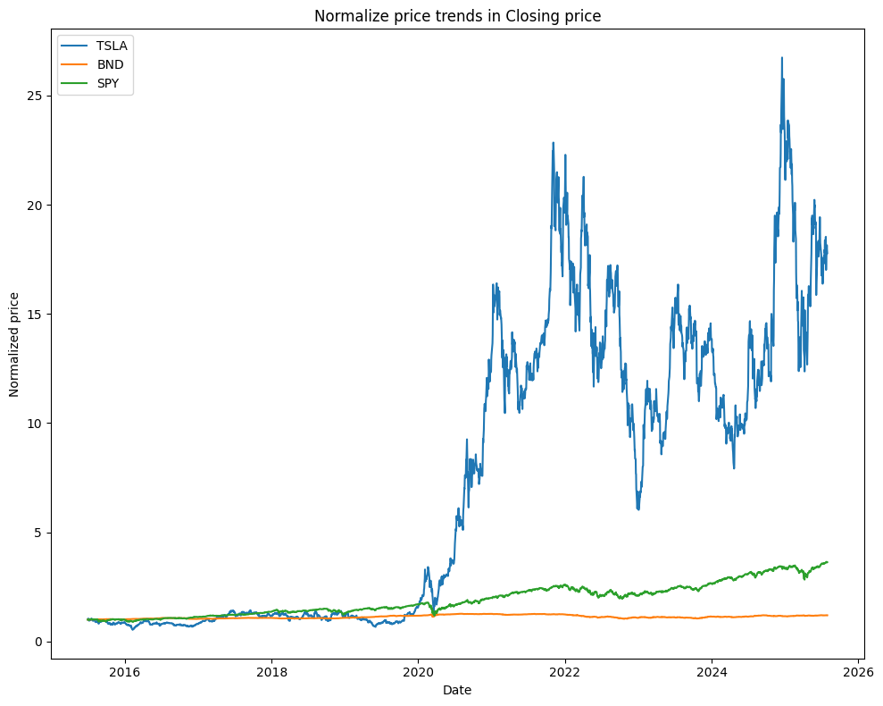
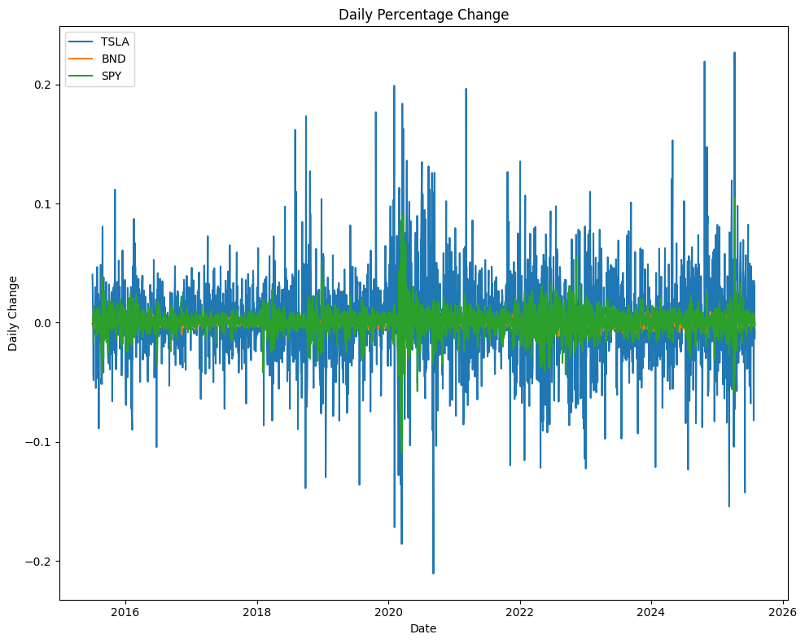
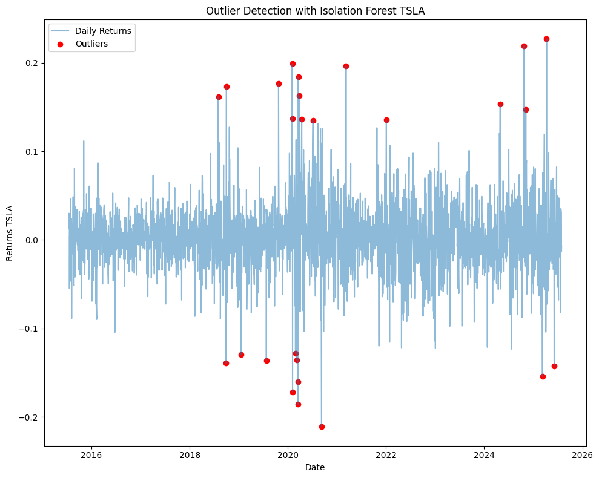
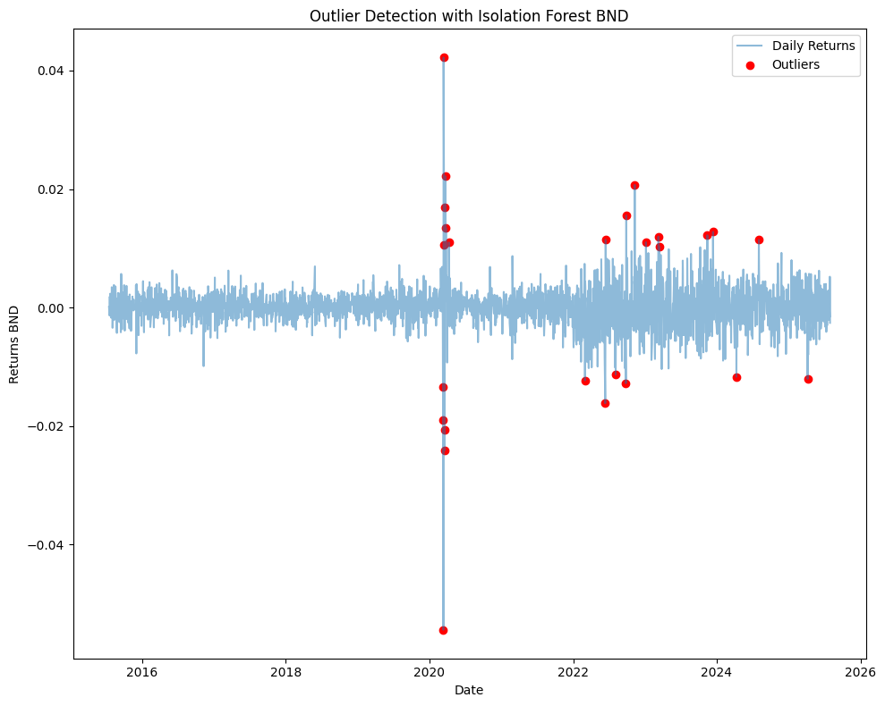
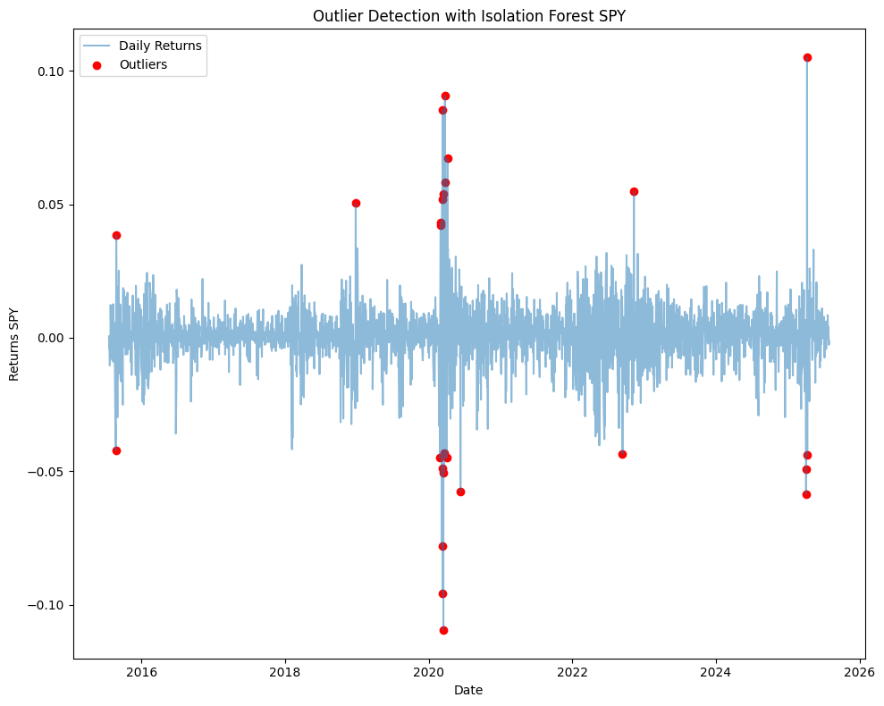

# Time Series Forecasting for Portfolio Management Optimization

## Risk and Return Analysis

| Ticker | Annualized Volatility | Annualized Return | Sharpe Ratio |
|--------|-----------------------|-------------------|--------------|
| SPY    | 18.2%                 | 14.5%             | 0.79         |
| TSLA   | 59.2%                 | 46.1%             | 0.78         |
| BND    | 5.5%                  | 2.0%              | 0.36         |








- **Tesla (TSLA)** experiences **very high volatility (59%)**, indicating large fluctuations in daily returns. This volatility is accompanied by a **high annualized return (46%)**, which is more than three times SPY’s return. However, its **Sharpe ratio (~0.78)** is slightly lower than SPY’s, suggesting that although Tesla delivers greater returns, it does so with proportionally higher risk, resulting in a comparable but slightly less efficient risk-adjusted performance.

- **SPY** shows **moderate volatility (18%)** and solid returns (14.5%). Its **Sharpe ratio (0.79)** is the highest among the three, reflecting the best balance of return relative to risk. SPY is therefore a more stable investment option offering attractive risk-adjusted returns.

- **BND** is the safest with very low volatility (5.5%) and low returns (2%). Its Sharpe ratio is the lowest (0.36), reflecting a conservative investment profile suitable for risk-averse investors who prioritize capital preservation over growth.

## Implications

- Tesla’s high volatility means it can generate high returns but also carries the risk of large losses.
- SPY offers a more balanced risk-return profile, ideal for investors seeking steadier growth.
- Bonds (BND) provide safety with low returns and minimal risk.

## Business Objective

Guide Me in Finance (GMF) Investments is a forward-thinking financial advisory firm specializing in personalized portfolio management. GMF leverages advanced time series forecasting models to predict market trends, optimize asset allocation, and enhance portfolio performance—helping clients achieve financial goals by minimizing risks and maximizing opportunities.

## Situational Overview (Business Need)

As a Financial Analyst at GMF, you will:

- Extract historical financial data for TSLA, BND, and SPY using YFinance.
- Preprocess and analyze the data to identify trends and patterns.
- Develop and evaluate forecasting models (ARIMA, LSTM).
- Recommend portfolio adjustments based on forecasted trends to optimize returns and manage risk.

## Data

- Historical stock prices (Open, High, Low, Close, Volume) and adjusted close prices.
- Period: July 1, 2015 – July 31, 2025.
- Assets:  
  - TSLA (high growth, high risk)  
  - BND (bonds for stability)  
  - SPY (broad market exposure)

## Expected Outcomes

- Proficient use of APIs (yfinance) and data wrangling with pandas.
- Feature engineering including returns and volatility calculations.
- Time series modeling with ARIMA and LSTM.
- Model evaluation and portfolio optimization.
- Ability to communicate financial insights professionally.


## Setup and Run

Clone the project repository:
## Setup and Run

Clone the project repository:

```bash
git clone https://github.com/yohannes4321/Time-Series-Forecasting-for-Portfolio-Management-Optimization.git
cd Time-Series-Forecasting-for-Portfolio-Management-Optimization
```
Create and activate a virtual environment:

Windows:
```bash
python -m venv venv
venv\Scripts\activate
```

macOS/Linux:
```bash
python3 -m venv venv
source venv/bin/activate
```
Install required packages:
```bash
pip install -r requirements.txt
```


### Data Scientist Yohannes Alemu